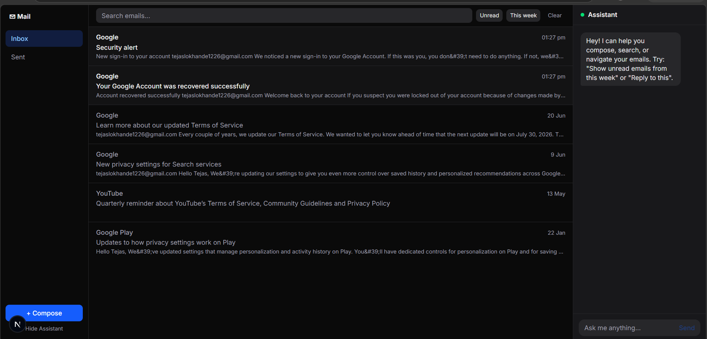
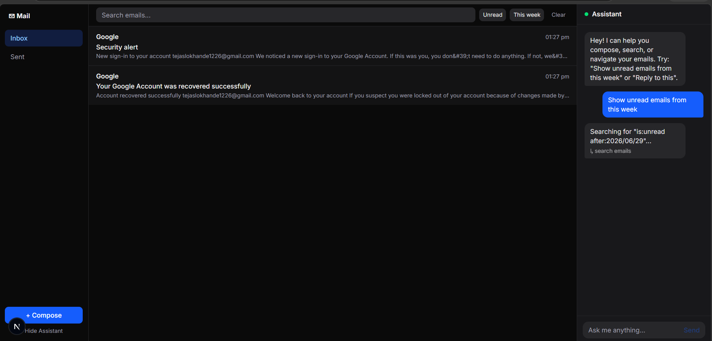
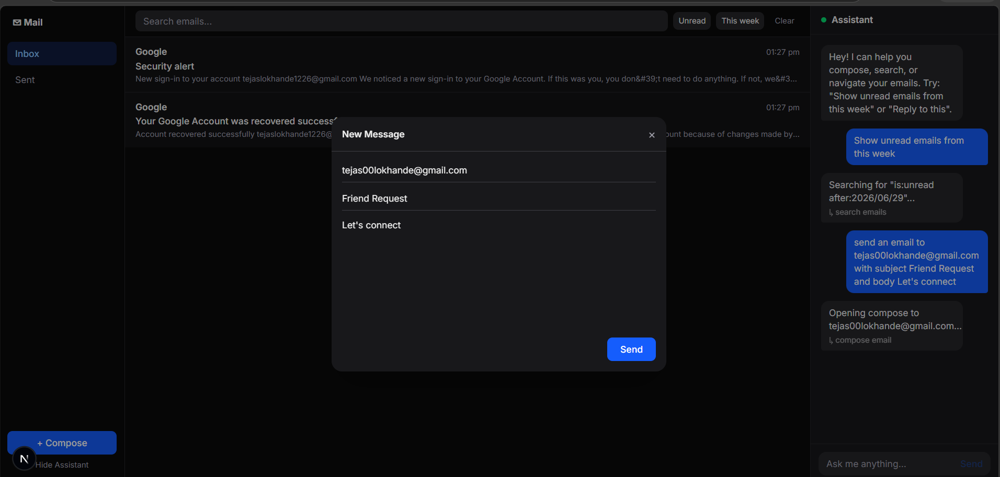
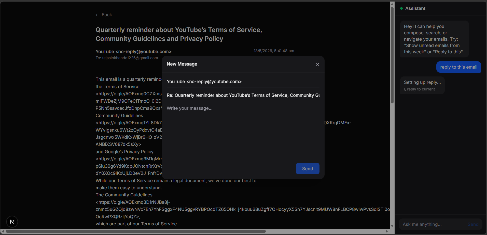

# Mail App — AI-Powered Email Client

A Gmail connected mail client where an AI assistant does not just chat, it can actually **control the UI** to help you manage your inbox.

## Setup

1. Clone the repo
2. Copy `.env.example` to `.env.local` and fill in:
   - `GOOGLE_CLIENT_ID` / `GOOGLE_CLIENT_SECRET` — from Google Cloud Console
   - `ANTHROPIC_API_KEY` — from console.anthropic.com
   - `NEXTAUTH_SECRET` — any random string (`openssl rand -base64 32`)

3. Enable Gmail API in Google Cloud Console
4. Add `http://localhost:3000/api/auth/callback/google` as an OAuth redirect URI

Then install dependencies and start the dev server:
```bash
npm install
npm run dev
```

## Architecture

- **Next.js App Router** for routing and server components
- **NextAuth.js** for Google OAuth — stores access token in JWT session
- **Gmail API** via `googleapis` SDK — all mail operations go through `lib/gmail.ts`
- **Claude API (tool use)** — assistant responds with structured tool calls that map to UI actions, not just text
- **Polling every 30s** for real-time sync (trade-off: Pub/Sub needs a public webhook URL, complex for local dev)

The key architectural decision: the assistant panel calls `/api/assistant` which returns both a text message AND an action object. The parent component handles that action by updating state — opening modals, triggering fetches, navigating. Clean separation.

## What I would improve with more time

- Proper Gmail Pub/Sub push notifications instead of polling
- Thread/conversation view (group by threadId)
- Token refresh handling (access tokens expire after 1 hour)
- More robust error handling + retry logic for Gmail API rate limits
- Tests for the Gmail service layer and Claude tool parsing

## Screenshots





